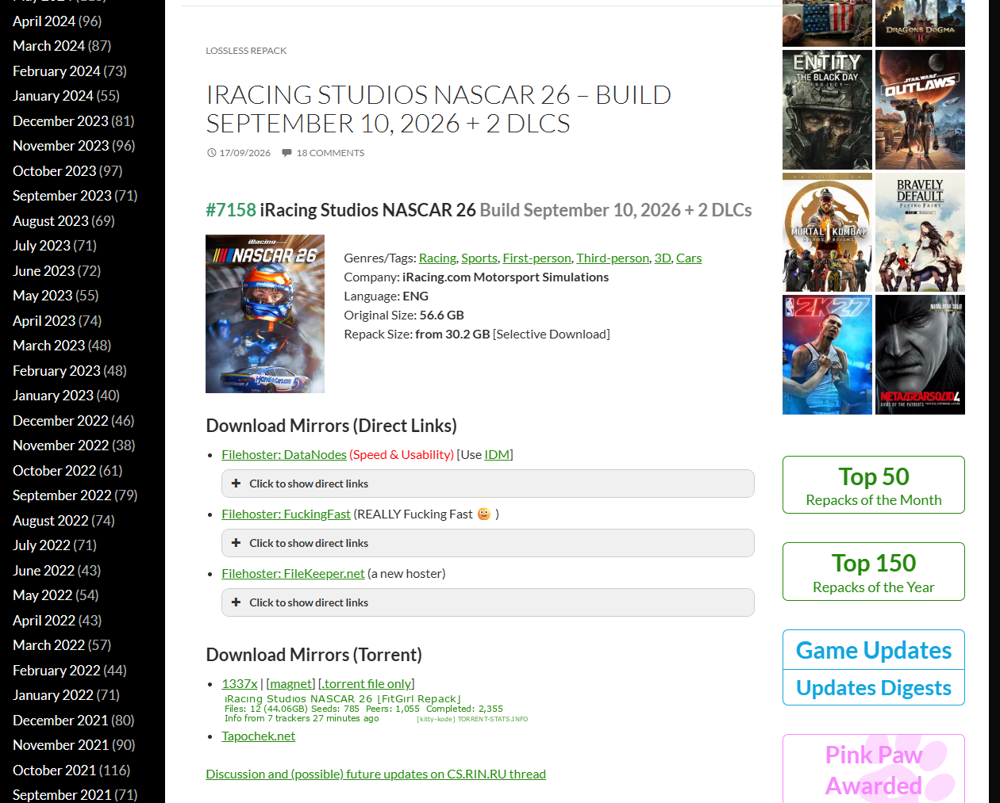
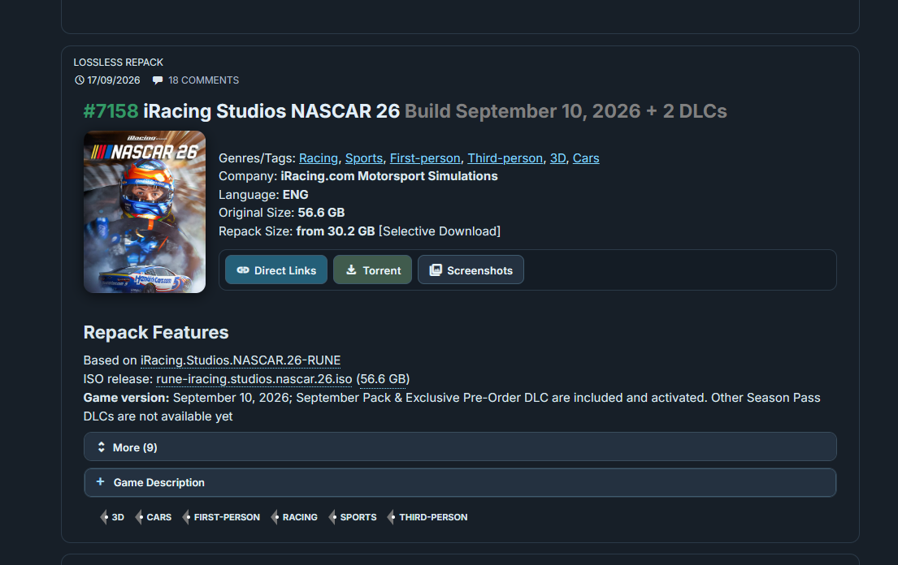
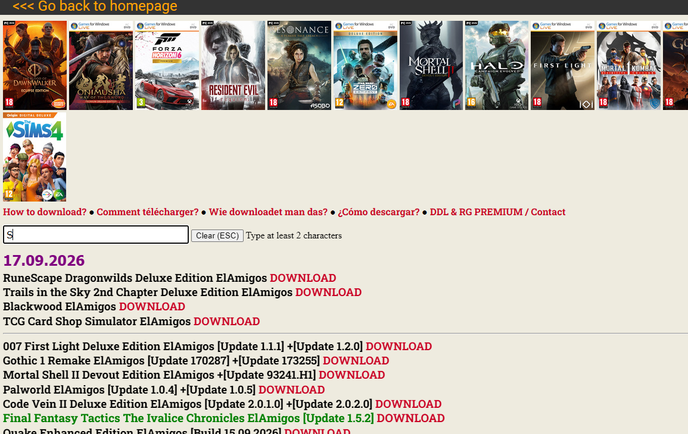
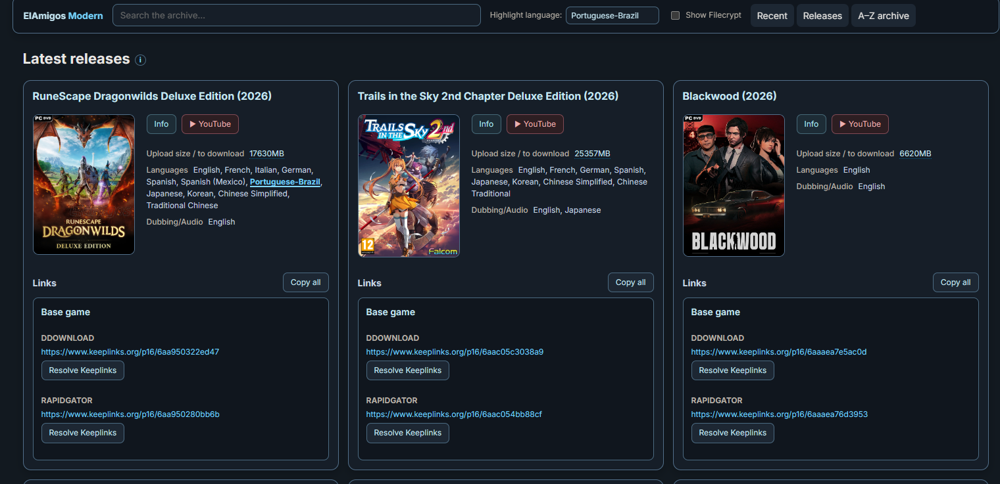
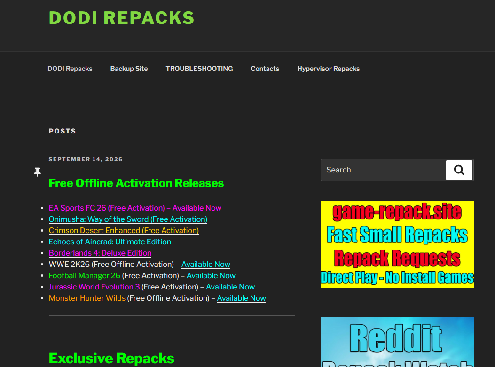
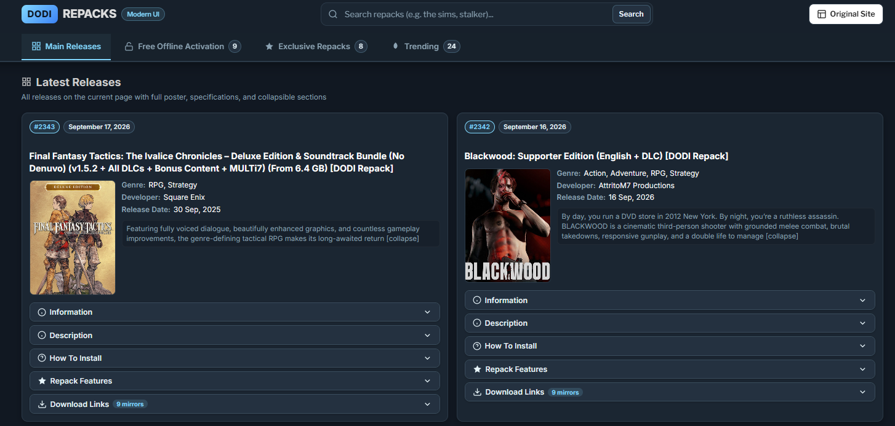

# game-night

Userscripts that replace the default layout on FitGirl, ElAmigos, and DODI Repacks with compact dark interfaces. Install only on sites you trust and use in line with applicable law and each site's terms.

## Install

Install one userscript manager first:

- [Violentmonkey](https://violentmonkey.github.io/get-it/) for Chrome, Edge, Firefox, and other supported browsers.
- [Tampermonkey](https://www.tampermonkey.net/) for Chrome, Edge, Firefox, Safari, and other supported browsers.
- Any manager that supports standard `@match`, `@grant`, `@downloadURL`, and `@updateURL` metadata.

Open an install link, let the manager show its review page, then choose Install:

| Site | Userscript |
| --- | --- |
| [FitGirl](https://fitgirl-repacks.site/) | [Install FitGirl Modern Dark UI](https://raw.githubusercontent.com/alfablac/game-night/main/fitgirl.user.js) |
| [ElAmigos](https://elamigos.site/) | [Install ElAmigos Modern UI](https://raw.githubusercontent.com/alfablac/game-night/main/elamigos.user.js) |
| [DODI Repacks](https://dodi-repacks.site/) | [Install DODI Repacks Modern UI & Shortlink Bypass](https://raw.githubusercontent.com/alfablac/game-night/main/dodi.user.js) |

Userscript managers check the raw GitHub URL for newer versions. If a script was installed from its former Gist URL, reinstall it once from this page so its update source changes to this repository.

## Screenshots

Current homepage captures. Each left image shows the site before the userscript loads. The right image shows the site with its userscript active. Page content changes over time.

| Site | Before | After |
| --- | --- | --- |
| FitGirl |  |  |
| ElAmigos |  |  |
| DODI Repacks |  |  |

## What each script does

### FitGirl Modern Dark UI

Applies a dark layout, updated typography, responsive carousels, collapsible post sections, and a compact upcoming-releases view. On a `Filehoster:` list item, it reads HTTP(S) anchors inside its spoiler or details block, removes duplicate URLs, and adds a button that copies those URLs as newline-separated text. It does not resolve or open the links.

### ElAmigos Modern UI

Builds a responsive release browser with recent releases, pagination, an A-Z archive, game detail modals, technical details, and video links. When it parses a release page, headings such as `Base game`, updates, patches, DLC, and host labels create display groups. It retains links only for supported container or host domains, then lists them under those groups.

For Keeplinks containers, the script requests the container page and extracts unique anchors from its live link section. For Filecrypt, it opens a verification frame, reads file rows after that page is ready, and resolves each `/Link/` page to its `/Go/` URL. Filecrypt verification can require a user action and may block embedded frames. A failed resolver leaves the original container available.

### DODI Repacks Modern UI & Shortlink Bypass

Rebuilds post cards, search, pinned sections, pagination, and game detail modals. It reads the post content beginning at `Download Links`, skips page notices and footers, then turns paragraphs and list items into categories, titles, and mirror buttons. Links in one row become fallback candidates for each other.

Zovo links use background requests to follow the site's form sequence after its required wait. Resolved destinations are cached in userscript storage and IndexedDB. If one mirror fails, the script tries other Zovo links from the same row. Network filters, blockers, or changes to the shortlink site can stop this flow; the original post remains available.

## Permissions and data

The scripts run only on domains listed in their metadata. ElAmigos and DODI request cross-origin HTTP access to load release pages or resolve supported containers. DODI stores resolved Zovo URLs in browser IndexedDB and userscript storage. ElAmigos may use a configured 2Captcha key for Keeplinks verification; do not enter a key you do not control.

## Development

The `.user.js` files are installed directly; there is no build step. Keep the existing
layout and styles shown in `docs/screenshots` when changing behavior.

Use Node.js 22.13+ (22.x) or 24+ and the pnpm version pinned in `package.json`:

```sh
pnpm install --frozen-lockfile
pnpm exec playwright install chromium
pnpm check
```

`pnpm check` runs syntax checks, ESLint (including userscript metadata), and offline
Chromium regression tests. The tests load the complete userscripts against synthetic
pages with mocked userscript APIs and network responses. They do not access the live
sites, resolve real download links, or require a userscript manager. CI runs the same
checks; on Linux, `playwright install --with-deps chromium` also installs system
dependencies.

For a release, also check the home, search, archive and detail views at desktop and
mobile sizes in a userscript manager. Fixtures cannot detect markup changes on the
live sites or manager-specific permission behavior.
